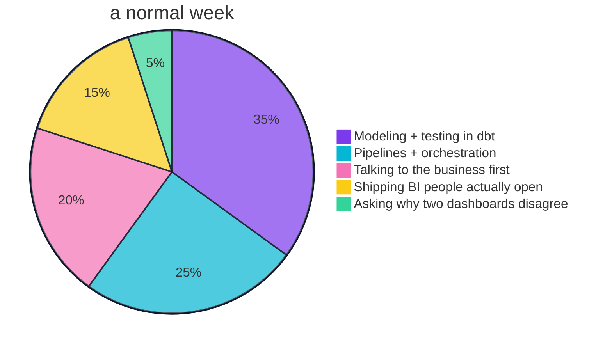
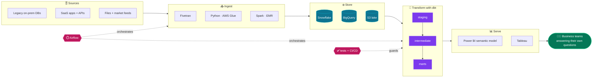
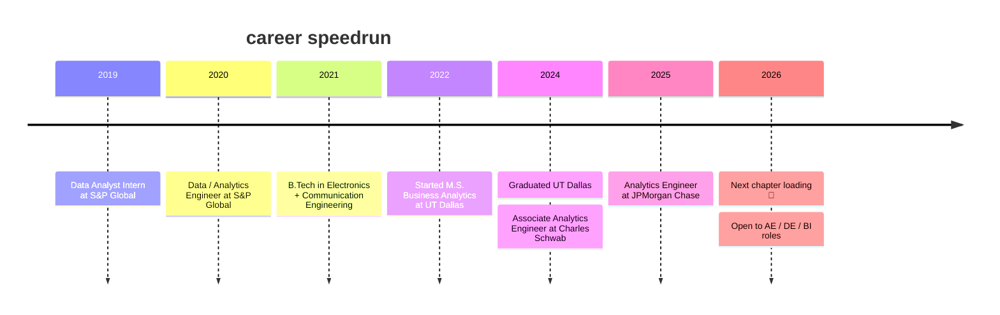

<!-- ========================================================= -->
<!--  README for github.com/darak479  |  paste into darak479/darak479/README.md  -->
<!--  Lines marked "ADD METRIC" are optional slots for REAL numbers only.        -->
<!-- ========================================================= -->

<div align="center">


<a href="https://www.linkedin.com/in/nihaldarak512/">

</a>

<br/>


<a href="https://www.linkedin.com/in/nihaldarak512/"></a>
<a href="mailto:nihal@myworkgmail.com"></a>


</div>

---

## `$ whoami`

```yaml
name:        Nihal Darak
role:        Analytics Engineer  # 5+ years
based_in:    Waukesha, Wisconsin 🧀
worked_at:   [JPMorgan Chase, Charles Schwab, S&P Global]
industries:  [financial services, market intelligence, telecommunications]
education:   M.S. Business Analytics @ UT Dallas
superpower:  turning "hey, can you pull this for me?" into a dashboard nobody has to ask for again
looking_for: Analytics Engineer / Data Engineer / BI Engineer roles at teams that move fast
off_duty:    [pickleball for hours, hunting down new cafes, chasing waterfalls]
```

---

## 📊 Impact Dashboard

<div align="center">


</div>

| ⚡ Impact area | 🛠️ What that looks like in practice | 📌 Receipt |
| :-- | :-- | :-- |
| **Legacy → cloud** | Moving on-prem databases into Snowflake, BigQuery and S3, with modeled and tested layers on top instead of a lift-and-shift mess | Snowflake · BigQuery · S3 <!-- ADD METRIC: e.g. tables migrated, runtime before vs after --> |
| **Manual → automated** | Replacing hand-run scripts and spreadsheet refreshes with orchestrated, CI-tested pipelines | Airflow · GitHub Actions <!-- ADD METRIC: e.g. hours/week saved --> |
| **Data you can trust** | Severity-graded dbt tests that warn early and block loudly before bad data ever reaches a dashboard | [analytics-quality-pipeline](https://github.com/darak479/analytics-quality-pipeline) |
| **Governed self-serve BI** | Semantic models in Power BI and Tableau so analysts answer their own questions instead of waiting in a ticket queue | Power BI (DAX) · Tableau <!-- ADD METRIC: e.g. # of users or reports --> |
| **Finance-grade reconciliation** | SCD2 history, incremental facts, and auto-flagged breaks when numbers don't match the custodian | [portfolio-reconciliation-engine](https://github.com/darak479/portfolio-reconciliation-engine) |

<details>
<summary><b>🍕 where my week actually goes (vibes-based, not audited)</b></summary>
<br/>



</details>

---

## 💼 How I Work (my operating system)

> **"The best dashboard is the one nobody has to ask me to update."**

<table>
<tr>
<td width="33%" valign="top">

### 🎯 Label the pain first
Before I pick a tool, I find out what's actually broken for the business and who is feeling it. The tech choice comes second.

</td>
<td width="33%" valign="top">

### 🔁 Twice = pipeline
If I do something by hand twice, it becomes a scheduled, tested job. Humans are for judgment, not for re-running scripts.

</td>
<td width="33%" valign="top">

### 🧪 Trust is a feature
A pipeline without tests is a rumor. Every model ships with tests and docs, so people can rely on the number, not just see it.

</td>
</tr>
</table>

---

## 🏗️ The Platform I Build



---

## 📈 The Plot So Far



---

## 🎖️ Receipts (things I built, not just claimed)

<table>
<tr>
<td width="50%" valign="top">

### 🧪 [Automated Data Quality Pipeline](https://github.com/darak479/analytics-quality-pipeline)

**The pain:** data quality checks that only happen when someone remembers to run them.

**The build:** dbt + DuckDB + GitHub Actions. Every push rebuilds the warehouse, runs the full test suite, and posts a readable report. Staging issues **warn**, mart issues **block**, and the mart layer actually dedupes instead of just flagging.

**The twist:** an optional AI-written summary that falls back to a deterministic report, because a pipeline should never break when an LLM call does.

`dbt` `DuckDB` `GitHub Actions` `Python` `Claude API`

</td>
<td width="50%" valign="top">

### 💰 [Portfolio Reconciliation Engine](https://github.com/darak479/portfolio-reconciliation-engine)

**The pain:** month-end close depends on someone catching when internal portfolio values drift from what the custodian reports.

**The build:** holdings rebuilt from trade logs with window functions, priced against a daily market feed in an incremental fact table, then compared to custodian statements. Anything off by more than 2% gets flagged.

**The twist:** a real SCD Type 2 snapshot of client allocations, proven end to end with a simulated rebalance, feeding a governed Power BI model with DAX measures.

`dbt` `BigQuery` `Fivetran` `Power BI` `SCD2`

</td>
</tr>
</table>

---

## 🛠️ My Stack, Arranged Like a Pipeline

<div align="center">

</div>
<br/>

| 📥 Ingest | ❄️ Store | 🧱 Transform | ⏱️ Orchestrate | 📊 Serve |
| :-: | :-: | :-: | :-: | :-: |
|  |  |  |  |  |
|  |  |  |  |  |
|  |  |  |  |  |
|  |  |  |  |  |

---

## 🔭 Right Now

- 🔨 **Building** public dbt projects that mirror real production patterns (see receipts above)
- 📚 **Studying for** the Claude Certified Architect (Foundations) exam
- 🤖 **Using AI** to speed up docs, tests and code review, not to replace engineering judgment
- 💬 **Ask me about** SCD2 snapshots, incremental models, or why your two dashboards show different revenue
- 🏓 **Hot take:** pickleball is the only cardio I will voluntarily do for three hours

> 🤝 **Hiring?** If your team is growing fast and your data still lives in spreadsheets and Slack threads, I'd love to talk. [LinkedIn](https://www.linkedin.com/in/nihaldarak512/) is the fastest way to reach me.

---

## 🐍 Automation in Action

This snake is a scheduled GitHub Action that regenerates itself every day. Same instinct as my day job: if it can run on a schedule, it shouldn't need a human.

<div align="center">


</div>

<details>
<summary><b>📊 GitHub stats</b></summary>
<br/>
<div align="center">


</div>
</details>

<div align="center">


</div>
